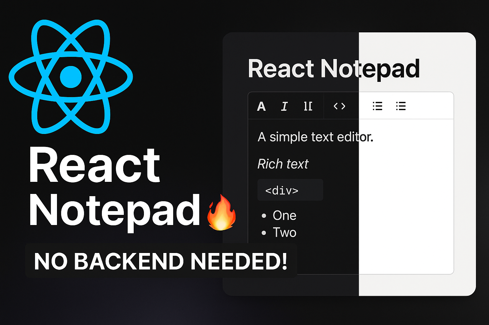

# 🧠 React Notepad – Notion-Style Rich Text Editor

A powerful and minimalist Notepad app built with **React**, **Zustand**, **Tiptap**, and **TailwindCSS**, fully working in the browser via **localStorage**.  
Inspired by Notion. No backend required.



---

## 🎥 YouTube Tutorial

📺 Watch the full build tutorial on YouTube:  
🔗 [React Notepad | CRUD + Rich Text Editor | No Backend Required](https://youtu.be/FIERmgWJJFI)

---

## ✨ Features

- 📝 Notion-style **rich text editor**
- ⚙️ Global state management with **Zustand**
- 💾 **LocalStorage CRUD**: create, edit, delete notes
- 🎨 Responsive and beautiful UI via **TailwindCSS**
- 🧱 Block-level formatting (bold, italic, code, lists, etc.)
- ⚡️ Fast build using **Vite** and **TypeScript**

---

## 🚀 Quick Start

```bash
git clone https://github.com/humoyun-dev/notepad
cd notepad
npm install
npm run dev
````

App will run at: `http://localhost:5173`

---

## 🛠 Tech Stack

* React + TypeScript
* Zustand
* Tiptap (ProseMirror-based rich text editor)
* TailwindCSS
* Lucide React Icons
* Vite

---

## 📦 Notes Format

Each note is stored like this in `localStorage`:

```json
{
  "id": "uuid",
  "title": "Note title",
  "content": "<p>rich text HTML...</p>"
}
```

---

## 📌 To-Do (Ideas)

* [ ] Drag-and-drop note blocks
* [ ] Dark mode toggle
* [ ] Search and filter
* [ ] Export/import notes
* [ ] Firebase/MongoDB sync version

---

## 📜 License

MIT — free to use, modify, and share.

---

## 🙌 Author

Created by [HumoyunDev](https://github.com/humoyun-dev)
📹 YouTube Channel: [youtube.com/@humoyun-dev](https://www.youtube.com/@humoyun-dev)
